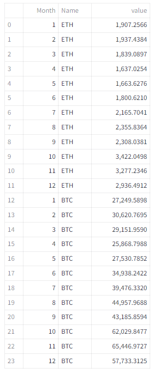

# Streamlit Supports 5 Important Data Visualization Libraries - Which to Choose?

## We code examples using Altair, Bokeh, Plotly, Pandas Plot and Matplotlib, to illustrate the pros and cons of each one

Imagine your organisation has decided to use Streamlit as its primary platform for showcasing data visualization applications and, to ensure a consistent look, it wants to adopt a single graphing library to be used across all applications. And, let's say, your job is to investigate which is most appropriate.

You are spoiled for choice! There are 5 libraries you can use for coding your data visualizations: Altair, Bokeh, Plotly, Pyplot (Matplotlib) and Vega Lite. And Streamlit provides some native charts, as well.

Let's take a look at each one and code up some commonly used charts. 

The data that we will use is a set of price data for a pair of cryptocurrencies and from that data we will create a line chart showing the change in closing prices over a year for both currencies, a grouped bar chart showing the same data, again, for both currencies and a scatter chart with a trendline showing the correlation between the change in value of the two currencies.

The charts will look similar to the ones in the image below.


### The data

The dataset we will use is a simple three-column dataframe. It tracks the closing prices of two cryptocurrencies over a 12-month period. It is not important for the exercise but the currencies are Ethereum and Bitcoin and the period is the previous 12 months. (The data are a matter of public record and are available from several sources. I retrieved them from [Yahoo Finance]([Crypto Real Time Prices &amp; Latest News - Yahoo Finance](https://finance.yahoo.com/crypto/)).)

Below is a screenshot of the data that we will use.


This is wide format data which while entirely suitable for human readers and, for this article, this data is in the file *crypto-23.csv* . This wide format shows the different observations (here, the closing prices) in seperate columns (here, headed ETH and BTC).   However, some data visulaization packages (as we shall see) require the data to be presented in _long_ format where the observations are in a single column and seperate column contains a label for the observation.

If the data we see above is in the form af a Pandas dataframe (which it is!), we can create a new dataframe in long format using the Pandas `melt()`function in the following Python code.

```python
cryptoL = cryptoW.melt(value_vars=['ETH','BTC'],
          var_name='Name',
          id_vars=['Month'])
```

You can look up `melt`in the [Pandas documentation](https://pandas.pydata.org/docs/reference/api/pandas.melt.html) but basically this code creates a new column called _Name_ which contains the values from the original columns _ETH_ and _BTC_. The _Month_ column remains a single column but it is expanded lengthwise to match _Name_ and the values for the months are repeated as required. The result can be seen in the image below.

 

### The charts

More pecifically the charts that we want to create are:

_Line chart_: The line chart should track both currencies over the period and show two seperate lines of different colours for each currency.

_Bar chart_: the bar chart should be a grouped bar chart that tracks the two currencies over the period. The bars should be vertical and grouped such that the pair of currencies are shown next to each other in each month. Each curreny should be coloured differently.

_Scatter chart_: The scatter chart should show the relationship between the closing prices of each currency and in addition show include a trendline to indicate the linearity (or otherwise) of that relationship.

Additionally, each chart should have a title and appropriate labels on the x and y axes.

### The options

First, let's do a quick review of the options so we can eliminate any obvious non-starters.

__Built-in charts__

The first thing to look at is the set of built-in functions that Streamlit provides. They will draw simple line charts, bar charts and scatter plots. And, as the documentation states, these are simply wrappers around Altair equivalents. The documentation also suggests that if these simple charts don't work for you, you should use the Altair charts, instead.

A quick look at the documentation will confirm that these charts cannot produce any of the three charts in this experiment as they cannot display more than one trace per chart. We won't explore these any further.

__Vega-Lite__

Vega-Lite is a powerful graphing language that specifies charts in a JSON format [1]. Writing a Vege-Lite specification can be an arduous and error-prone task which is why Altair was developed. Altair is a Python library that outputs Vega-Lite specs, so If you already have Vega-Lite specifications to hand then the Vega-Lite library is the obvious one to use. But to create a chart from scratch it has to be better to use the Altair library which is a Python-friendly way of producing the same thing.

__The rest__

The remaining libraries are all powerful and Python-friendly ways of producing sophisticated charts and we will explore them further.  But we'll look at one of the libraries in two ways.'

Streamlit's `st.pyplot()`function is a way of displaying Matplotlib figures but, of course, there are other plotting libraries that are built on Matplotlib: Seaborn, Plotnine and Pandas Plots, for example. To show how we can use these we will include a version of the graphs created with Pandas Plots in addition to those created directly in Matplotlib.

So, we will create the three graphs in each of Altair, Bokeh, Matplotlib, Pandas Plots and Plotly.

### Altair

Altair[3] is a graphing library based on the concept of the Grammar of Graphics [2]. Instead of implementing specific chart types, with Altair you start with the data and then decide how that data should be mapped onto the various aspects of a graphical representation. (For a more detailed look at Altair, please see my article [Mastering Data Visualizaton with Altair’s Grammar of Graphics](https://medium.com/towards-data-science/altair-and-the-powerful-vega-lite-grammar-of-graphics-d1d864c3e08e).)

To implement the three graphs we first need to included the libraries and import the data.

```python
import streamlit as st
import pandas as pd
import altair as alt

cryptoW = pd.read_csv("crypto-23.csv")
cryptoL = cryptoW.melt(value_vars=['ETH','BTC'],
          var_name='Name',id_vars=['Month'])

```

The Streamlit package, of course, along with Pandas and Altair. The data is in a _CSV_ file and, as you can see we import the _wide_ version and then create a _long_ version of the data in the variable `cryptoL`.

To create any Altair chart we start with the code `alt.Chart()`, pass it the data and then map the data onto the various parts of the chart. The code for the line chart follows.

```python
fig = alt.Chart(cryptoL, 
                width=800, 
                title='Cryptocurrency closing prices'
                ).mark_line().encode(
                    x = 'Month:O',
                    y = 'value:Q',
                    color = 'Name:N')

st.altair_chart(fig)
```

We specify the dataframe that we are going to use as a parameter (there are other parameters that we could include, here we set the title and width). The `mark_line()` method specifies that we want a line chart and the encodings that follow determine the way the data is mapped onto the chart: the month is on the `x` axis, the value on the `y`axis and the `color`is specified by the name of the currency. Note that the codes appended to the names of the data fields are Altair types, `O`is ordinal, `Q`is qualitative and `N`is nominal.

The resulting graph is shown below. (In this rendition, the text is not that easy to see but the title, x and y label and the legend are perfectly visible in the Streamlit app).

 


So, tick! That's our first graph completed. Let's do the other two.

The grouped bar chart code is very similar. This time we use the method `mark_bar`. Without any modification this will gives is a stacked bar chart but bt specifying an x offset, we can shift the bars sideways and produce a grouped chart.

```python
fig = alt.Chart(cryptoL, 
                width=800,
                title='Cryptocurrency closing prices'
                ).mark_bar().encode(
                    x = 'Month:O',
                    y = 'value:Q',
                    color = 'Name:N',
                    xOffset = 'Name:N')

st.altair_chart(fig)
```

You can see the result below (the earler comment applies to the text here, too).


The scatter chart is slightly more complicated because we want to include a trendline

The code below is very similar to the other charts but here we use the wide form of the data and the method `mark_point()`. Additionally, the x and y data are the two currencies.

```python
fig = alt.Chart(cryptoW, 
                width=800,
                title='Cryptocurrency closing prices'
                ).mark_point().encode(
                    x = 'BTC',
                    y = 'ETH')
```

As it stands that code would be sufficient to draw a scatter chart. To add the trendline we need to do a little more work.

```python
trend = fig.transform_regression('BTC', 'ETH').mark_line()
```

Altair has built-in transfom functions and here we use the function `transform_regression()`to create a line chart of `ETH`versus `BTC`.

To combine the two charts we simple 'add' them together.

```python
st.altair_chart(fig + trend)
```

The `+`combines the two graphs placing one on top of the other resulting in the following chart.


That is correct but not so pretty. It would be better if we could ignore the left side of the chart that is blank. We can fix this with the slightly longer version shown below.

```python
fig = alt.Chart(cryptoW, 
                width=800,
                title='Cryptocurrency closing prices'
                ).mark_point().encode(
                    x = alt.X('BTC',scale=alt.Scale(domain=[20000, 70000])),
                    y = 'ETH')

trend = fig.transform_regression('BTC', 'ETH').mark_line()

st.altair_chart(fig + trend)
```

This is fundamentall the same chart but we have specified the x axis in a different way (using the `alt.X()` function. By doing this we can pass values for the scale and here we specifiy thay the x scale should beging at 20000 and end at 70000. This code gives us a better rendition.


We completed the first task. Altair has givens us perfectly good charts with not too much effort.

### Bokeh


### Matplotlib

### Pandas Plots

### Plotly

### So, where does that leave us

### Notes

1. [Vega-Lite: A Grammar of Interactive Graphics](http://vis.csail.mit.edu/pubs/vega-lite), Arvind Satyanarayan, Dominik Moritz, Kanit Wongsuphasawat and Jeffrey Heer, *IEEE Transactions on Visualization & Computer Graphics (Proc. IEEE InfoVis)*, 2017

2. Leland Wilkinson's seminal, The Grammar of Graphics (Statistics and Computing) 2nd Edition (2005), is listed on [Amazon](https://amzn.to/3HVR3mS). It’s not cheap!

3. [Altair: Interactive Statistical Visualizations for Python](https://joss.theoj.org/papers/10.21105/joss.01057), Jacob VanderPlas, et al. _Journal of Open Source Software, 3(32), 1057

*Links to Amazon are affiliate links which means if you purchase something I may get a small commission but it will not affect the price you pay*

All images and screenshots are by me, the author, unless otherwise noted.
