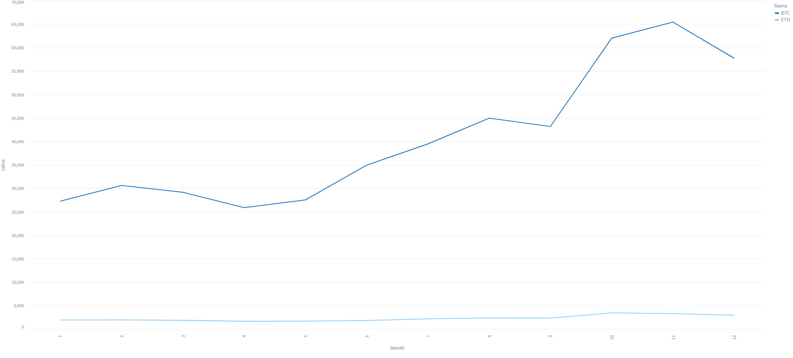
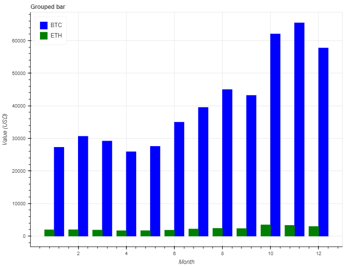
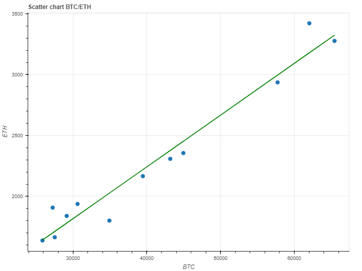
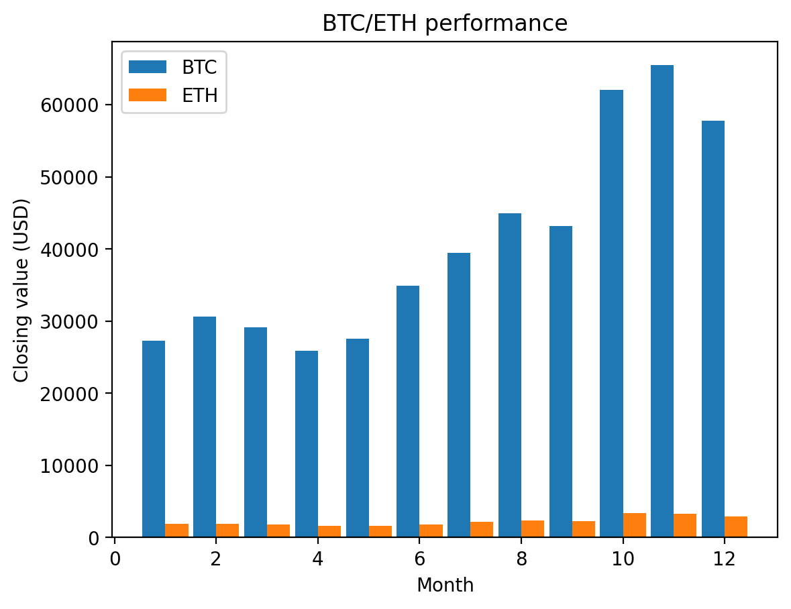
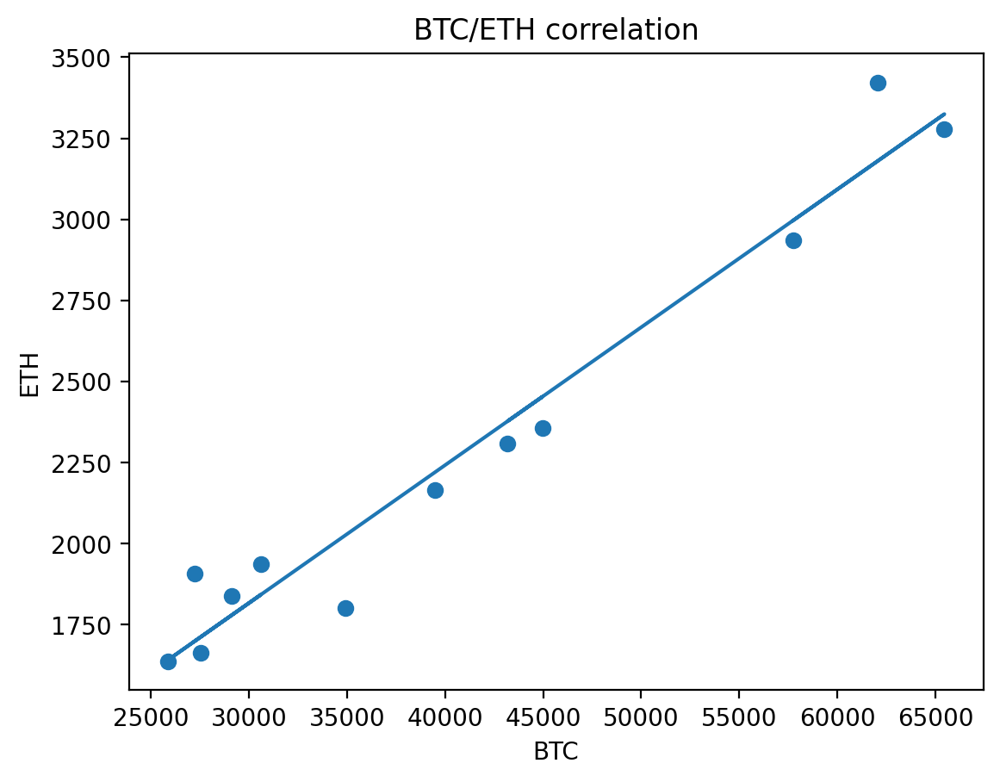
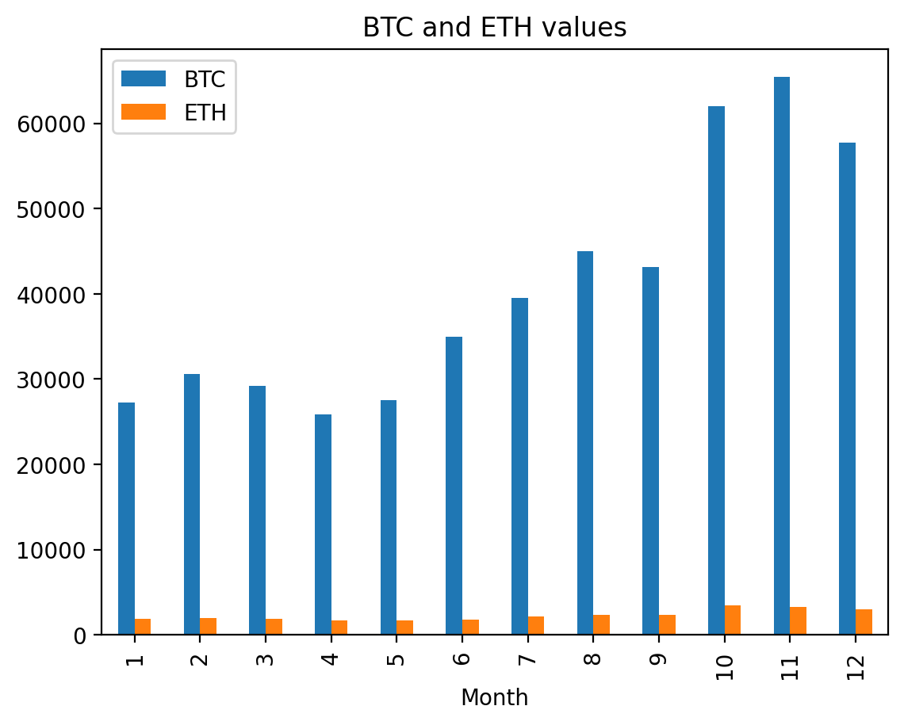

Imagine your organisation has decided to use Streamlit as its primary platform for showcasing data visualization applications and, to ensure a consistent look, it wants to adopt a single graphing library to be used across all applications. And, let's say, your job is to investigate which is most appropriate.

You are spoiled for choice! There are 5 libraries you can use for coding your data visualizations: Altair, Bokeh, Plotly, Pyplot (Matplotlib) and Vega Lite. And Streamlit provides some native charts, as well.

Let's take a look at each one and code up some commonly used charts. 

The data that we will use is a set of price data for a pair of cryptocurrencies and from that data we will create a line chart showing the change in closing prices over a year for both currencies, a grouped bar chart showing the same data, again, for both currencies and a scatter chart with a trendline showing the correlation between the change in value of the two currencies.

The charts will look similar to the ones in the image above.

### The data

The dataset is a simple three-column table. It tracks the closing prices of two cryptocurrencies over a 12-month period. It is not important for the exercise but the currencies are Ethereum and Bitcoin and the period is the previous 12 months from the time of writing. (The data are a matter of public record and are available from several sources. I retrieved them from [Yahoo Finance]([Crypto Real Time Prices &amp; Latest News - Yahoo Finance](https://finance.yahoo.com/crypto/)).)

Below is a screenshot of the data that we will use.


This representation of the data is *wide format* with each observation (the closing price) in its own column. For this article, this data is assumed to be in the file *crypto-23.csv* . This wide format shows the different observations (here, the closing prices) in seperate columns (headed ETH and BTC) and is entirely suitable for human readers. However, some data visualization packages require the data to be presented in _long_ format where the observations are in a single column and seperate column contains a label for the observation.

If the data is in the form af a Pandas dataframe (which it is!), we can create a new dataframe in long format using the Pandas `melt()`function in the following Python code.

```python
cryptoL = cryptoW.melt(value_vars=['ETH','BTC'],
          var_name='Name',
          id_vars=['Month'])
```

You can look up `melt`in the [Pandas documentation](https://pandas.pydata.org/docs/reference/api/pandas.melt.html) but basically this code creates a column called _value_ which contains the values from the original columns _ETH_ and _BTC_. The _Month_ column remains a single column but it is expanded lengthwise to match _value_ and the numbers of the months are repeated as required. A new column _Name_ is created that will contain the value _ETH_ or _BTC_ and labels the _value_ in the same row. The result can be seen in the image below.

 

### The charts

More specifically the charts that we want to create are:

_Line chart_: The line chart should track both currencies over the period and show two seperate lines of different colours, one for each currency.

_Bar chart_: the bar chart should be a grouped bar chart that tracks the two currencies over the period. The bars should be vertical and grouped such that the pair of currencies are shown next to each other in each month. The bar for each currency should be coloured differently.

_Scatter chart_: The scatter chart should show the relationship between the closing prices of each currency and in addition show include a trendline to indicate the linearity (or otherwise) of that relationship.

Additionally, all charts should have a title and appropriate labels on the x and y axes.

### The options

First, let's do a quick review of the options so we can eliminate any obvious non-starters.

__Streamlit charts__

The first thing we should look at is the set of built-in functions that Streamlit provides. They will draw simple line charts, bar charts and scatter plots. And, as the documentation states, these are simply wrappers around the Altair equivalents. The documentation also suggests that if these simple charts don't work for you, you should use the Altair charts, instead.

A quick look at the documentation will confirm that these charts cannot produce any of the three charts in this exercise as they cannot display more than one trace per chart. We won't explore these any further.

__Vega-Lite__

Vega-Lite is a powerful graphing language that specifies charts in a JSON format [1]. Writing a Vega-Lite specification can be an arduous and error-prone task which is why Altair was developed. Altair is a Python library that outputs Vega-Lite specs, so If you already have Vega-Lite specifications to hand then the Vega-Lite library is the obvious one to use. But to create a chart from scratch it has to be better to use the Altair library which is a Python-friendly way of producing the same thing. We won't explore Vega-Lite any further, either.

__The rest__

The remaining libraries are all powerful and Python-friendly ways of producing sophisticated charts and these we will explore further. But we'll look at one of the libraries in two ways.

Streamlit's `st.pyplot()`function is a way of displaying Matplotlib figures but, of course, there are other plotting libraries that are built on Matplotlib: Seaborn, Plotnine and Pandas Plots, for example. To show how we can use these we will include a version of the graphs created with Pandas Plots in addition to those created directly in Matplotlib.

So, we will create the three graphs in each of Altair, Bokeh, Matplotlib, Pandas Plots and Plotly.

### Altair

Altair[3] is a graphing library based on the concept of the Grammar of Graphics [2]. Instead of implementing specific chart types, with Altair you start with the data and then decide how that data should be mapped onto the various aspects of a graphical representation. (For a more detailed look at Altair, please see my article [Mastering Data Visualizaton with Altair’s Grammar of Graphics](https://medium.com/towards-data-science/altair-and-the-powerful-vega-lite-grammar-of-graphics-d1d864c3e08e).)

To implement the three graphs we first need to included the libraries and import the data.

```python
import streamlit as st
import pandas as pd
import altair as alt

cryptoW = pd.read_csv("crypto-23.csv")
cryptoL = cryptoW.melt(value_vars=['ETH','BTC'],
          var_name='Name',id_vars=['Month'])
```

We import the Streamlit package, of course, along with Pandas and Altair. The data is in a _CSV_ file and, as you can see we import the _wide_ version in `cryptoW`,  and then create a _long_ version of the data in the variable `cryptoL`.

To create any Altair chart we start with the code `alt.Chart()`, pass it the data and then map the data onto the various parts of the chart. The code for the line chart follows.

```python
fig = alt.Chart(cryptoL, 
                width=800, 
                title='Cryptocurrency closing prices'
                ).mark_line().encode(
                    x = 'Month:O',
                    y = 'value:Q',
                    color = 'Name:N')

st.altair_chart(fig)
```

We specify the dataframe that we are going to use as a parameter (there are other parameters that we could include, here we set the title and width). The `mark_line()` method specifies that we want the data represented as a line and the encodings that follow determine the way the data is mapped onto the chart: the month is on the `x` axis, the value on the `y`axis and the `color`is specified by the name of the currency. Note that the codes appended to the names of the data fields are Altair types, `O`is ordinal, `Q`is qualitative and `N`is nominal.

The resulting graph is shown below. (In this rendition, the text is not very easy to see but the title, x and y label and the legend are perfectly visible in the Streamlit app).



So, tick! That's our first graph completed. Let's do the other two.

The grouped bar chart code is very similar. This time we use the method `mark_bar`. Without any modification this will gives is a stacked bar chart but by specifying an x offset, we can shift the bars sideways and thereby produce a grouped chart.

```python
fig = alt.Chart(cryptoL, 
                width=800,
                title='Cryptocurrency closing prices'
                ).mark_bar().encode(
                    x = 'Month:O',
                    y = 'value:Q',
                    color = 'Name:N',
                    xOffset = 'Name:N')

st.altair_chart(fig)
```

You can see the result below (the earlier comment applies to the text here, too).


The scatter chart is slightly more complicated because we want to include a trendline

The code below is very similar to the other charts but here we use the wide form of the data and the method `mark_point()`. The x and y data are the two currencies.

```python
fig = alt.Chart(cryptoW, 
                width=800,
                title='Cryptocurrency closing prices'
                ).mark_point().encode(
                    x = 'BTC',
                    y = 'ETH')
```

As it stands that code would be sufficient to draw a scatter chart. To add the trendline we need to do a little more work.

```python
trend = fig.transform_regression('BTC', 'ETH').mark_line()
```

Altair has built-in transform functions and here we use the function `transform_regression()`to create a line chart of `ETH`versus `BTC`.

To combine the two charts we simply 'add' them together.

```python
st.altair_chart(fig + trend)
```

The `+` operator combines the two graphs placing one on top of the other resulting in the following chart.


That is correct but not ideal. It would be better if we could ignore the left side of the chart that is blank. We can fix this with the longer version shown below.

```python
fig = alt.Chart(cryptoW, 
                width=800,
                title='Cryptocurrency closing prices'
                ).mark_point().encode(
                    x = alt.X('BTC',scale=alt.Scale(domain=[20000, 70000])),
                    y = 'ETH')

trend = fig.transform_regression('BTC', 'ETH').mark_line()

st.altair_chart(fig + trend)
```

This is fundamentally the same chart but we have specified the x axis in a different way (using the `alt.X()` function). By doing this we can pass values for the scale and here we specify that the x scale should begin at 20000 and end at 70000. This code gives us a better rendition.


We have completed the first task. Altair has givens us perfectly good charts with not too much effort.

### Bokeh

The Bokeh library has a similar feel to Altair in that it starts with  a figure object and builds the chart chat that. But the figure specifies mostly decorative elements of the chart. The graphical elements are built on top as attributes to the figure object.

Here's the initial code that imports the library and the data.

```python
import streamlit as st
import pandas as pd
from bokeh.plotting import figure

cryptoW = pd.read_csv("crypto-23.csv")
```

Now we add a figure with some textual attributes.

```python
p = figure(title="Line chart ETH and BTC prices", 
          x_axis_label="Month", 
          y_axis_label="Value (USD)")
```

To this initial figure we can add graphical elements such as lines. The next piece of code adds line graphs for the two currencies.

```python
p.line(cryptoW['Month'], 
    cryptoW['BTC'], 
    legend_label="BTC", 
    color = 'blue',
    line_width=2)
p.line(cryptoW['Month'], 
    cryptoW['ETH'], 
    legend_label="ETH", 
    color = "green",
    line_width=2)
p.legend.location = "top_left"

st.bokeh_chart(p)
```

 As you can see the `line()`function is invoked twice, once for each of the currencies (with appropriate labels, colours and line width) and we (optionally) change the default position of the legend to the top left so that it doesn't obscure the lines in the graph.

Below we can see the resulting graph.


The result is, of course, similar to the Altair version but with a different style.

The grouped bar chart is very similar but uses the `vbar()`function to plot the data, and like the Altair version would default to a stacked bar. With Bokeh we can use `dodge()`as a parameter which shifts the bars horizontally. First, we set a width for the bars (a full bar would have a width of 1 but since there are two bars they should be a maximum of 0.5 each. Here we set them to 0.4 so there is a gap between them). We then we use the width divided by 2 to set the offset for each bar.  

```python
from bokeh.transform import dodge
p = figure(title="Grouped bar", 
          x_axis_label="Month", 
          y_axis_label="Value (USD)")
width = 0.4

p.vbar(
    x=dodge("Month",width/2), 
    legend_label="BTC",
    top="BTC",
    width=width,
    source=cryptoW,
    color='blue'
)
p.vbar(
    x=dodge("Month",-width/2), 
    legend_label="ETH",
    top="ETH",
    width=width,
    source=cryptoW,
    color='green'
)
p.legend.location = "top_left"
st.bokeh_chart(p)
```

The chart is show below.



Finally, we need to draw the scatter plot. We start by defining the figure as before and then creating a simple scatter plot.

```python
p = figure(title="Scatter chart BTC/ETH", 
          x_axis_label="BTC", 
          y_axis_label="ETH",
          width=800)

p.circle(cryptoW['BTC'], cryptoW['ETH'], size=8) 
```

We set the point size in the scatter plot to 0.8 which is appropriate for this chart. And then we create a line chart which is the trendline. We create the trendline using Numpy to determine the cooefficients for a first level regression plot and then create a new column in the dataframe from that.

```python
# Add trend line to scatter plot
import numpy as np
# Calculate regression params
m,b = np.polyfit(cryptoW.BTC, cryptoW.ETH, 1)

# Add a trendline to the dataframe
cryptoW["trendline"] = [y for  y in  m*cryptoW.BTC + b]

p.line(cryptoW['BTC'], 
      cryptoW['trendline'],  
      color = "green",
       line_width=2)

st.bokeh_chart(p)
```

When this line is added to the chart we get the following figure.



Again, a perfectly adequate chart.

### Matplotlib

Like many libraries, Matplotlib gives us a set of basic chart types to choose from and then provides a set of functions that can modify that chart.

Matplotlib requires you to engage with your charts at a fairly low level but in doing this gives you a lot of control over the result.

For Matplotlib we will use only the wide format data. Here's the intial code.

```python
import streamlit as st
import pandas as pd
import matplotlib.pyplot as plt

cryptoW = pd.read_csv("crypto-23.csv")
```

And let's see the code for the line chart.

```python
fig, ax = plt.subplots()

ax.plot(cryptoW['Month'], cryptoW['BTC'])
ax.plot(cryptoW['Month'], cryptoW['ETH'])
plt.xlabel("Month")
plt.ylabel("Closing value (USD)")
plt.title("BTC/ETH performance")
plt.legend(['BTC','ETH'])
st.pyplot(fig)
```

We first define a Matplotlib plot in the first line of code. This gives us two variables that will contain the final figure and the axes that are elements of that figure.

I hope you can see that using Matplotlib we simply build a plot with a series of statements. First, we create the line plots for the two currencies (the Matplotlib functio `plot()`creates a line plot for the x and y data provided).

And following that, we specifiy the textual properties of the plot and the legend.

The line plot is shown below.


The bar chart is very similar. In the code below we specify the width of a bar and set the individual to that width but shifting it horizontally by adding or subtracting half of the column width. This gives us the grouped chart that we want and is a similar technique to the ones we've seen earlier.

```python
fig, ax = plt.subplots()
width = 0.45
ax.bar(cryptoW['Month']-width/2, cryptoW['BTC'], width=width)
ax.bar(cryptoW['Month']+width/2, cryptoW['ETH'], width=width)
plt.xlabel("Month")
plt.ylabel("Closing value (USD)")
plt.title("BTC/ETH performance")
plt.legend(['BTC','ETH'])
st.pyplot(fig)
```

The result can be seen below.



A next, of course, the scatter diagram.

Again the code is similar to create the initial scatter plot. After that, we determine the cooeficients for a regression line with Numpy (as above) and create a trendline column in the dataframe. A line plot is created from that trendline and added to the figure.

```python
fig, ax = plt.subplots()
ax.scatter(cryptoW['BTC'], cryptoW['ETH'])
plt.xlabel("BTC")
plt.ylabel("ETH")
plt.title("BTC/ETH correlation")

import numpy as np
m,b = np.polyfit(cryptoW.BTC, cryptoW.ETH, 1)

# Add a trendline to the dataframe
cryptoW["trendline"] = [y for  y in  m*cryptoW.BTC + b]
st.table(cryptoW)

ax.plot(cryptoW['BTC'], cryptoW['trendline'])

plt.xlabel("BTC")
plt.ylabel("ETH")
plt.title("BTC/ETH correlation")
st.pyplot(fig)
```

The resulting figure is shown below.



Matplotlib is a fairly low level charting package and other, higher level, packages have been created on top of this library and we will look at one of these next.

### Pandas Plots

Pandas incorporates plotting functions and it is simply a matter of using the appropriate method on a dataframe to create a chart.

The initial code is the same as Matplotlib because we are using exactly the same packages.

```python
import streamlit as st
import pandas as pd
import matplotlib.pyplot as plt

cryptoW = pd.read_csv("crypto-23.csv")
```

And we also need to define the `fig`and `ax`variables in the same way as we did with Mathplotlib. Below is the code to produce a line chart for just the ETH prices.

```python
# ETH line chart
fig, ax = plt.subplots()
cryptoW.plot(y='ETH', x='Month', title='ETH values', ax=ax)
st.pyplot(fig)
```

You can see that we call a method on the dataframe itself `plot()`, this will produce a line chart from the parameters given. Note that it is important that we refer to the `ax` variable in the call - this effectively adds the new line plot to the figure that we defined at the beginning.

With Pandas Plots we can specify any number of `y`variables by passing a list as a parameter. So, to plot a line chart for both ETH and BTC the code is almost identical.

```python
fig, ax = plt.subplots()
cryptoW.plot(y=['BTC','ETH'], x='Month',
             title='BTC and ETH values', ax=ax)
st.pyplot(fig)
```

This code is a little shorter than the Matplotlib code as Pandas makes assumptions about the names of the axes - it takes them from the column name by default although you can change this if you wish. The line chart is shown below.


The grouped bar code is almost identical except for the name of the method to be called; here it is `plot.bar()`rather than simply `plot()`.

```python
fig, ax = plt.subplots()
cryptoW.plot.bar(y=['BTC','ETH'], x='Month', 
                 title='BTC and ETH values', ax=ax)
st.pyplot(fig)
```

We don't need to mess around with the positioning of the bars in order to create a grouped set of bars, Pandas defaults to creating a grouped representation when given a list of `y`values.



To create a simple scatter plot we use the method `plot.scatter()`and otherwise the code is very similar to the other charts. However, to add the trendline we need to create a separate plot.

Below is the code to create the basic scatter plot.

```python
fig, ax = plt.subplots()
ax = cryptoW.plot.scatter(y='ETH', x='BTC', 
                          title='BTC and ETH values', ax=ax)
st.pyplot(fig)
```

As you see it is again very similar to the preceding code. To add the trendline we create a new column in the dataframe as we did previously.

```python
m,b = np.polyfit(cryptoW.BTC, cryptoW.ETH, 1)

# Add a trendline to the dataframe
cryptoW["trendline"] = [y for  y in  m*cryptoW.BTC + b]
```

Now we can plot a line form this new column and by including the existing axis `ax`, we add this new plot line to the existing figure. 

```python
cryptoW.plot(x = 'BTC', y = 'trendline', ax=ax)
st.pyplot(fig)
```

And when we plot the figure we get the scatter plot with the trendline as we see below.


Pandas plots gives you all of the flexibility of Matplotlib as you can still use the Matplotlib library to modify the figure using the `plt.*`methods but the syntax for plotting is a little cleaner when using a Pandas dataframe as the source of the plotting data.

### Plotly

Plotly has both high level and low level functions - Plotly Express is the recommended library as it incorporates a large number of standard charts, whereas lower level functions are provided by the Plotly Graphic Objects (GO) part of the package. Plotly, themselves, suggest that you use Plotly Express, which is built upon Plotly GO, and that is what we will do.

Plotly is generally better used with long format data, so our initial code includes the generation of this form of the data.

```python
import streamlit as st
import pandas as pd
import plotly.express as px

cryptoW = pd.read_csv("crypto-23.csv")
cryptoL = cryptoW.melt(value_vars=['ETH','BTC'],
                       var_name='Name',id_vars=['Month'])
```

Creating a line chart from the long data is achieved in a single line of code. Below we see that line and how it is plotted.

```python
fig = px.line(cryptoL, x="Month", y="value", 
              color='Name', title='BTC and ETH values')
st.plotly_chart(fig))
```

By specifiying the `y`value to be the `value`column we tell the function which data to use for the line chart and by including the `color` parameter, we ensure that we have seperate coloured lines (in this case one for each name). We set the name of the figure as a parameter - the axis labels are taken care of automatically.


The bar graph is equally easy and follows the same pattern. The default bar chart is a stacked one but we simply set the `barmode` parameter to `'group'`to get the grouped representation.

Again we create the figure in a single line of code.

```python
fig = px.bar(cryptoL, x="Month", y="value", color="Name", 
             barmode='group', title='BTC and ETH values')
st.plotly_chart(fig)
```

And the resulting figure is shown below.


When is comes to the scatter chart, Plotly provides built in trendline functionality. This require the inclusion of the _statsmodels_ library which, while not imported, must be installed.

```python
fig = px.scatter(cryptoW, x="ETH", y="BTC", 
                 trendline="ols", title='ETH/BTC values')
st.plotly_chart(fig)
```

In the code above we see the familiar pattern of a Plotly plot - and additional parameter `trendline`  will ensure that the regression line is calculated and drawn with no effort on the programmer's part.


That completes the set of charts for Plotly and for the whole exercise.

### So, where does that leave us

In terms of what the charts shows us, the line and bar charts illustrate the prices for these cryptocurrencies being pretty volatile and the scatter charts confirm what we can also see in the other charts that the two currencies tend to go up and down together - general sentiment about cryptocurrencies probably affects the value of most, if not all, of them.

But what about the libraries.

All of the libraries do a reasonable job although you might find some charts more attractive than others - the Matplotlib charts look a little more clunky than the others, for example (although this may mainly to do with the large font which can be easily changed with a little extra code, for example, `matplotlib.rcParams['font.size'] = 8` will reduce the size of all off the text in a figure and this being a global setting will affect all plots that are created after it is executed).

With a little effort you can customize any of the charts that we've looked at either by adjusting particular aspcts of a plot such as the height and width, or by adopting a different style sheet.

What is important ot the programmer, of course, is the ease with which you can code these figures. It's fair to say that the library that has the most compact code is Plotly Express, followed closely by Pandas Plots. With Altair, Bokeh and Matplotlib you need to do a little more work though working with any of the packages is fairly straightforward.

Another thing that might  sway your decision is the philosophy behind the libraries. 

Altair uses a Grammar of Graphics approach where you decide what you want to do with the data, whereas the others tend to favour solutions to standard problems by including a fixed library of chart types.

Matplotlib makes you build your charts from the bottom up and has a whole bunch of methods for adjusting and customizing graphs. Pandas Plots simplifies the Matplotlib approach but maintains its flexibility -  Matplotlib parameters and functions work with Pandas charts, too.

Bokeh, again, provides a lot of flexibility with the downside that you need to write a little more code than in other libraries.

Plotly, last but not least, provides a large number of fixed chart types and they are each customizable. If compact code is important then Plotly is probably the winner in this respect.

The decision is yours (or your organisation's). I could have simply stated my own preference at the beginning but the purpose of showing you the code is so you can judge for yourself.

---

Thanks for reading and I hope this has been helpful. You can find all of the above code and data in the [GitHub repo](https://github.com/alanjones2/streamlit-chart-varieties/tree/main/code)) for this article in the form of Streamlit programs. Feel free to download them for your reference.

To see more articles like this you can subscribe on [Medium](https://medium.com/@alan-jones/subscribe), subscribe to my free and occasional [newsletter](technofile.substack.com) or visit my [website](alanjones2.github.io).

---

### Notes

1. [Vega-Lite: A Grammar of Interactive Graphics](http://vis.csail.mit.edu/pubs/vega-lite), Arvind Satyanarayan, Dominik Moritz, Kanit Wongsuphasawat and Jeffrey Heer, *IEEE Transactions on Visualization & Computer Graphics (Proc. IEEE InfoVis)*, 2017

2. Leland Wilkinson's seminal, The Grammar of Graphics (Statistics and Computing) 2nd Edition (2005), is listed on [Amazon](https://amzn.to/3HVR3mS). It’s not cheap!

3. [Altair: Interactive Statistical Visualizations for Python](https://joss.theoj.org/papers/10.21105/joss.01057), Jacob VanderPlas, et al. _Journal of Open Source Software, 3(32), 1057

*Links to Amazon are affiliate links which means if you purchase something I may get a small commission but it will not affect the price you pay*

All images and screenshots are by me, the author, unless otherwise noted.
