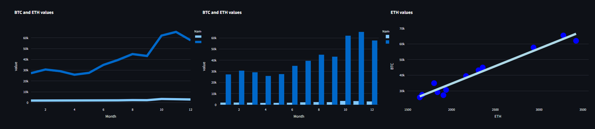

# Streamlit Supports 5 Data Visualization Libraries - Which to Choose?

## We code examples of each library to illustrate the pros and cons of each one

You are spoiled for choice! Five libraries for coding your data visualizations: Altair, Bokeh, Plotly, Pyplot (Matplotlib) and Vega Lite. And Streamlit provides a handful of native charts, as well.

We are going to take a look at each one and code up some commonly used charts. For each library, we will use a set of price data for a pair of cryptocurrencies and we will create:

- A single line chart showing the change in closing prices over a year for both currencies.

- A grouped bar chart showing the same data, again, for both currencies.

- A scatter chart with a trendline showing the correlation between the change in value of the two currencies.

The charts will look similar to the ones in the image below.

However, we are going to omit two things and include one extra one: we will not use the native Streamlit charting functions nor Vega-Lite but we will incorporate a version created with Pandas Plots. Here's the reasoning:

- The native visualization functions are fine for very simple graphs but are not up to creating the ones I want to implement here. But we shouldn't worry - the remaining functions are powerful and can manage to produce these charts without too much effort.

- It's not that Vega-Lite is not capable of producing complex graphs, it's just that it requires coding a graph as a JSON construct and this is arduous and error-prone. If you already have Vega-Lite specifications to hand then this is clearly the function to use but to create them from scratch it has to be better to use the Altair library which is a Python-friendly way of producing the same thing.

- Streamlit's `st.pyplot()`function is a way of displaying Matplotlib figures but, of course, there are other plotting libraries that are built on Matplotlib: Seaborn and Pandas Plots, for example. To show how we can use these we will include a version of the graphs created with Pandas Plots as well as directly in Matplotlib.

So, we will create the three graphs in each of Altair, Bokeh, Matplotlib, Pandas Plots and Plotly.

